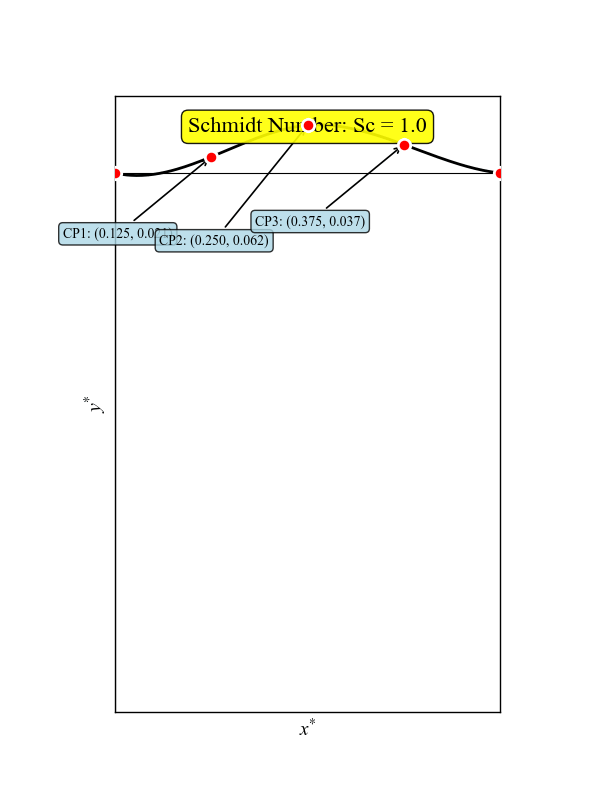

# PINN-DRL: Advanced Mixer Design Optimization

A comprehensive framework combining Physics-Informed Neural Networks (PINN) with multi-objective optimization for enhanced mixer design.

*Above: Baffle geometry evolution and flow field changes across Schmidt numbers (Sc 1-100)*

## 🚀 Overview

FlexPINN integrates deep learning with physics-based modeling to optimize complex mixer geometries, featuring:

- **Physics-Informed Neural Networks** for accurate flow prediction
- **Multi-parameter optimization** using Genetic Algorithms and Reinforcement Learning
- **Real-time visualization** of geometry and flow field evolution

## 📁 Project Structure

├── flexpinn/ **Core PINN implementation**

├── ga_optimization/ **Genetic Algorithm optimization**

├── drl_optimization/ **Deep Reinforcement Learning optimization**
